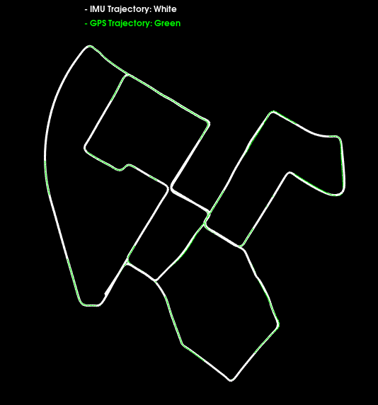

# IMU preintegration with Symforce

This repository provides an implementation of a factor graph with IMU preintegration in symforce (C++). We use GPS measurements for pose factors, the symforce/slam ImuFactor for preintegration and between factors for Accelerometer and Gyroscope bias. In createFactors.h we provide the implementation for adding the factors.
The first timestep also has a prior factor on pose, velocity, and accelometer/gyroscope bias.

You can read more about the IMU preintegration in symforce [here](https://symforce.org/api-cpp/file/imu__factor_8h.html)

# KITTI dataset

To verify the IMU preintegration in Symforce we test it on the well-known KITTI dataset and closely replicate the IMU preintegration example from [GTSAM](https://github.com/borglab/gtsam/blob/develop/examples/IMUKittiExampleGPS.cpp). We skip GPS measurements such that we have 10 poses with an ImuFactor for every measured pose, but optimize the pose at every time step to retrieve IMU rate estimates. Prior factors are based on the first GPS measurement and IMU metadata, see 'initializeValuesKITTI' for more info. We follow the GTSAM example and set the ACCEL_BIAS_DIAG_SQRT_INFO to be one over the square root of number of IMU measurements times the accelerometer/gyroscope bias sigma. While GTSAM sets a fixed TIME_DELTA for IMU measurements we set it directly from the measurements for that pose, but the difference here will in this example be negligible.



Note that there are some slight differences from GTSAM.

- GTSAM uses the precision matrix (information matrix) while symforce uses the square root of this

Sample IMU and GPS measurements from KITTI are displayed below:

```plaintext
-- Reading sensor metadata
IMU metadata: 0.000000 0.000000 0.000000 0.000000 0.000000 0.000000 0.010000 0.000175 0.000000 0.000167 0.000003 0.010040
-- Reading IMU measurements from file
-- Reading GPS measurements from file
Sample GPS Measurements:
      Time   Position (X)   Position (Y)   Position (Z)
46534.4784        -6.8269       -11.8682         0.0403
46537.3880         3.8971         7.5451         0.0248

Sample IMU Measurements:
      Time      Accel (X)      Accel (Y)      Accel (Z)     AngVel (X)     AngVel (Y)     AngVel (Z)
46534.4784         1.7115         0.1718         9.8053        -0.0032         0.0312        -0.0064
46536.3980         0.8342         0.6852        10.0984         0.0062         0.0075         0.0190
Sample IMU Pose:  -6.8269 -11.8682   0.0403	Sample GPS Pose:  -6.8269 -11.8682   0.0403
Sample IMU Pose: 3.8971 7.5451 0.0248	Sample GPS Pose: 3.8971 7.5451 0.0248
Sample IMU Pose:  8.0789 15.6420  0.0298	Sample GPS Pose:  8.0789 15.6420  0.0298
Sample IMU Pose: 12.5498 24.2821  0.1296	Sample GPS Pose: 12.5498 24.2821  0.1296
Sample IMU Pose: 16.9163 32.9653  0.1704	Sample GPS Pose: 16.9163 32.9653  0.1704

```

# Installation

To run the example, you can build locally with cmake or use Docker. The provided docker-compose.yml file sets up the necessary environment for running the IMU preintegration example.

```
xhost +
docker-compose down && docker-compose up --build
```

## Related Publications:

- Forster C, Carlone L, Dellaert F, et al. **On-Manifold Preintegration for Real-Time Visual--Inertial Odometry**. IEEE Transactions on Robotics, 2017, 33(1): 1-21. **[PDF](http://rpg.ifi.uzh.ch/docs/TRO16_forster.pdf)**.
