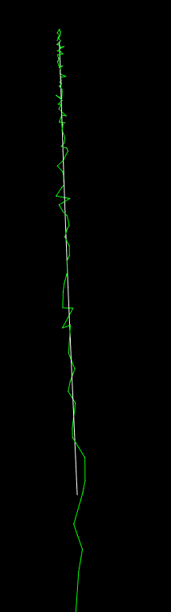

# IMU preintegration with Symforce

# KITTI dataset

https://github.com/borglab/gtsam/blob/develop/examples/IMUKittiExampleGPS.cpp

```plaintext
-- Reading sensor metadata
IMU metadata: 0.000000 0.000000 0.000000 0.000000 0.000000 0.000000 0.010000 0.000175 0.000000 0.000167 0.000003 0.010040
-- Reading IMU measurements from file
-- Reading GPS measurements from file
Sample GPS Measurements:
      Time   Position (X)   Position (Y)   Position (Z)
46534.4784        -6.8269       -11.8682         0.0403
46537.3880         3.8971         7.5451         0.0248

Sample IMU Measurements:
      Time      Accel (X)      Accel (Y)      Accel (Z)     AngVel (X)     AngVel (Y)     AngVel (Z)
46534.4784         1.7115         0.1718         9.8053        -0.0032         0.0312        -0.0064
46536.3980         0.8342         0.6852        10.0984         0.0062         0.0075         0.0190
Sample IMU Pose:  -6.8269 -11.8682   0.0403	Sample GPS Pose:  -6.8269 -11.8682   0.0403
Sample IMU Pose: 3.8971 7.5451 0.0248	Sample GPS Pose: 3.8971 7.5451 0.0248
Sample IMU Pose:  8.0789 15.6420  0.0298	Sample GPS Pose:  8.0789 15.6420  0.0298
Sample IMU Pose: 12.5498 24.2821  0.1296	Sample GPS Pose: 12.5498 24.2821  0.1296
Sample IMU Pose: 16.9163 32.9653  0.1704	Sample GPS Pose: 16.9163 32.9653  0.1704

```


